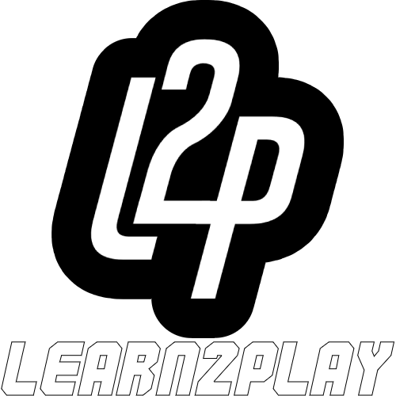

<p align="center"><a href="https://learn2play-socs.000webhostapp.com" target="_blank"></a><a href="https://laravel.com" target="_blank"></a></p>

## Table of Contents
* [General Info](#general-info)
* [Technologies](#technologies)
* [Setup](#setup)
* [Features](#features)
* [Project Status](#project-status)
* [Inspiration](#inspiration)

## General Info

Learn2Play is a web-based community app made with Laravel for the gaming community where they can post any guides on any games they like

## Technologies

- Laravel 8
- PHP 8
- Composer
- Bootstrap 5
- Microsoft Visual Studio Code
- XAMPP
- phpMyAdmin

## Setup

If you haven't already, you can download both <a href="https://www.php.net/downloads.php" target="_blank">PHP</a> and <a href="https://getcomposer.org/download/" target="_blank">Composer</a> by clicking the link provided and the site will guide you through the installation process. It is recommended that you match the version mentioned above

### Run XAMPP

First, you need to run XAMPP and start both Apache and MySQL. Doing so will enable you to access the project and phpMyAdmin from your browser.

### Creating Database

Head to your browser and enter https://localhost/phpmyadmin. Next, create a database named 'Learn2Play' then open the directory of the project, make sure you are inside the project folder, right click on an empty space and choose 'Open in Terminal' and type in ```php artisan migrate:fresh```.

### Running the Project

To run the project, type in ```php artisan serve``` on the terminal, then head to your browser and enter https://localhost:8000. If you followed the steps correctly, the home page of the project should appear.

## Features

- Login and Register
- Search Post
- Filter Post by Username and/or Category
- Create, Update, and Delete Posts
- Create, Update, and Delete Categories

## Project Status

Currently the project itself can be visited at https://learn2play-socs.000webhostapp.com.

### Problems

The image uploaded via website won't appear on the site as we haven't found a way to link both public and storage folder without using terminal to execute ```php artisan link:storage```. The image itself was uploaded to the storage folder but not the public folder.

### Planned Changes

We planned to add a few changes to our project in the future. Those features were:
- Making users able to edit their profile
- Adding images in-between paragraph

## Inspiration

This app is made based on <a href="https://github.com/sandhikagalih/coba-laravel" target="_blank">Laravel tutorial</a>
by <a href="https://github.com/sandhikagalih" target="_blank">Sandika Galih's<a>
